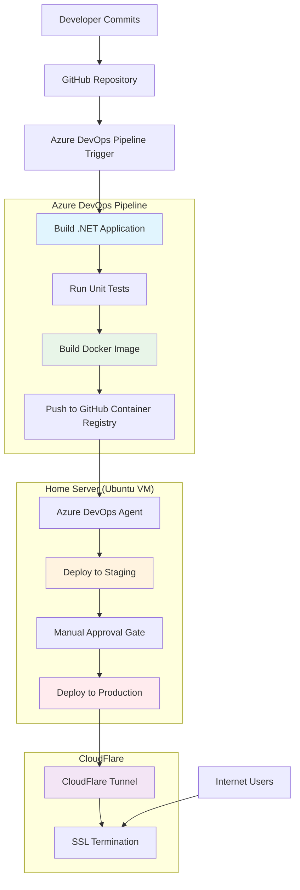

# Deployment Architecture - Infrastructure Modernization

## Overview
This document defines the detailed deployment architecture for the NFL Playoff Pool application, covering the complete deployment pipeline from development to production on the home server infrastructure.

## Deployment Pipeline Architecture

### CI/CD Pipeline Flow



## Environment Architecture

### Staging Environment

#### Container Configuration
```yaml
# Staging services in docker-compose.yml
webapp-staging:
  image: ghcr.io/[username]/nflplayoffpool:staging
  container_name: nflpool-webapp-staging
  ports:
    - "8080:5000"
  environment:
    - ASPNETCORE_ENVIRONMENT=Staging
    - ConnectionStrings__MongoDb=mongodb://mongodb-staging:27017/playoff_pool_staging
  depends_on:
    - mongodb-staging
  restart: unless-stopped
  deploy:
    resources:
      limits:
        memory: 1G
        cpus: '1.0'
  healthcheck:
    test: ["CMD", "curl", "-f", "http://localhost:5000/health"]
    interval: 30s
    timeout: 10s
    retries: 3
    start_period: 40s

mongodb-staging:
  image: mongo:7.0
  container_name: nflpool-mongodb-staging
  ports:
    - "27018:27017"
  environment:
    - MONGO_INITDB_ROOT_USERNAME_FILE=/run/secrets/mongo_root_username
    - MONGO_INITDB_ROOT_PASSWORD_FILE=/run/secrets/mongo_root_password
    - MONGO_INITDB_DATABASE=playoff_pool_staging
  volumes:
    - /opt/nflplayoffpool/staging/data:/data/db
    - mongodb_staging_config:/data/configdb
    - ./init-mongo-staging.js:/docker-entrypoint-initdb.d/init-mongo.js:ro
  secrets:
    - mongo_root_username
    - mongo_root_password
  restart: unless-stopped
  deploy:
    resources:
      limits:
        memory: 2G
```

#### Staging Characteristics
- **Purpose**: Pre-production testing and validation
- **Data**: Separate staging database with test data
- **Access**: `staging.fjapool.com` via CloudFlare tunnel
- **Deployment**: Automatic on successful build
- **Testing**: Automated health checks and manual validation

### Production Environment

#### Container Configuration
```yaml
# Production services in docker-compose.yml
webapp-prod:
  image: ghcr.io/[username]/nflplayoffpool:latest
  container_name: nflpool-webapp-prod
  ports:
    - "80:5000"
  environment:
    - ASPNETCORE_ENVIRONMENT=Production
    - ConnectionStrings__MongoDb=mongodb://mongodb-prod:27017/playoff_pool
  depends_on:
    - mongodb-prod
  restart: unless-stopped
  deploy:
    resources:
      limits:
        memory: 1G
        cpus: '1.0'
  healthcheck:
    test: ["CMD", "curl", "-f", "http://localhost:5000/health"]
    interval: 30s
    timeout: 10s
    retries: 3
    start_period: 40s

mongodb-prod:
  image: mongo:7.0
  container_name: nflpool-mongodb-prod
  ports:
    - "27017:27017"
  environment:
    - MONGO_INITDB_ROOT_USERNAME_FILE=/run/secrets/mongo_root_username
    - MONGO_INITDB_ROOT_PASSWORD_FILE=/run/secrets/mongo_root_password
    - MONGO_INITDB_DATABASE=playoff_pool
  volumes:
    - /opt/nflplayoffpool/production/data:/data/db
    - mongodb_prod_config:/data/configdb
    - ./init-mongo-prod.js:/docker-entrypoint-initdb.d/init-mongo.js:ro
  secrets:
    - mongo_root_username
    - mongo_root_password
  restart: unless-stopped
  deploy:
    resources:
      limits:
        memory: 2G
```

#### Production Characteristics
- **Purpose**: Live application serving real users
- **Data**: Production database with live data
- **Access**: `fjapool.com` via CloudFlare tunnel
- **Deployment**: Manual approval required
- **Monitoring**: Health checks and manual monitoring

## Deployment Process Design

### Automated Staging Deployment

#### Pipeline Stages
```yaml
# Azure DevOps pipeline for staging deployment
stages:
- stage: Build
  jobs:
  - job: BuildAndTest
    steps:
    - task: DotNetCoreCLI@2
      displayName: 'Restore packages'
      inputs:
        command: 'restore'
        projects: '**/*.csproj'
    
    - task: DotNetCoreCLI@2
      displayName: 'Build application'
      inputs:
        command: 'build'
        projects: '**/*.csproj'
        arguments: '--configuration Release'
    
    - task: DotNetCoreCLI@2
      displayName: 'Run unit tests'
      inputs:
        command: 'test'
        projects: '**/*Tests.csproj'
        arguments: '--configuration Release --collect:"XPlat Code Coverage"'

- stage: ContainerBuild
  dependsOn: Build
  jobs:
  - job: DockerBuild
    steps:
    - task: Docker@2
      displayName: 'Build Docker image'
      inputs:
        containerRegistry: 'GitHub Container Registry'
        repository: '[username]/nflplayoffpool'
        command: 'build'
        Dockerfile: 'Dockerfile'
        tags: |
          staging
          sha-$(Build.SourceVersion)
    
    - task: Docker@2
      displayName: 'Push Docker image'
      inputs:
        containerRegistry: 'GitHub Container Registry'
        repository: '[username]/nflplayoffpool'
        command: 'push'
        tags: |
          staging
          sha-$(Build.SourceVersion)

- stage: StagingDeploy
  dependsOn: ContainerBuild
  jobs:
  - deployment: DeployToStaging
    environment: 'staging'
    strategy:
      runOnce:
        deploy:
          steps:
          - task: SSH@0
            displayName: 'Deploy to staging'
            inputs:
              sshEndpoint: 'HomeServer'
              runOptions: 'commands'
              commands: |
                cd /opt/nflplayoffpool
                docker-compose pull webapp-staging
                docker-compose up -d webapp-staging
                docker-compose restart webapp-staging
          
          - task: SSH@0
            displayName: 'Verify staging deployment'
            inputs:
              sshEndpoint: 'HomeServer'
              runOptions: 'commands'
              commands: |
                sleep 30
                curl -f http://localhost:8080/health || exit 1
                echo "Staging deployment successful"
```

### Manual Production Deployment

#### Approval Process
1. **Staging Validation**: Verify staging environment functionality
2. **Manual Approval**: DevOps administrator approves production deployment
3. **Production Deployment**: Automated deployment with manual trigger
4. **Post-Deployment Verification**: Health checks and functionality validation

#### Production Pipeline Stage
```yaml
- stage: ProductionDeploy
  dependsOn: StagingDeploy
  condition: and(succeeded(), eq(variables['Build.SourceBranch'], 'refs/heads/main'))
  jobs:
  - deployment: DeployToProduction
    environment: 'production'
    strategy:
      runOnce:
        deploy:
          steps:
          - task: SSH@0
            displayName: 'Tag production image'
            inputs:
              sshEndpoint: 'HomeServer'
              runOptions: 'commands'
              commands: |
                docker tag ghcr.io/[username]/nflplayoffpool:sha-$(Build.SourceVersion) ghcr.io/[username]/nflplayoffpool:latest
                docker tag ghcr.io/[username]/nflplayoffpool:sha-$(Build.SourceVersion) ghcr.io/[username]/nflplayoffpool:v$(Build.BuildNumber)
          
          - task: SSH@0
            displayName: 'Deploy to production'
            inputs:
              sshEndpoint: 'HomeServer'
              runOptions: 'commands'
              commands: |
                cd /opt/nflplayoffpool
                docker-compose pull webapp-prod
                docker-compose up -d webapp-prod
                docker-compose restart webapp-prod
          
          - task: SSH@0
            displayName: 'Verify production deployment'
            inputs:
              sshEndpoint: 'HomeServer'
              runOptions: 'commands'
              commands: |
                sleep 30
                curl -f http://localhost:80/health || exit 1
                echo "Production deployment successful"
```

## Container Registry Integration

### GitHub Container Registry Configuration

#### Authentication Setup
```bash
# Azure DevOps service connection configuration
Service Connection Name: GitHub Container Registry
Registry URL: ghcr.io
Username: [GitHub username]
Password: [Personal Access Token with packages:write scope]
```

#### Image Tagging Strategy
```bash
# Semantic versioning approach
ghcr.io/[username]/nflplayoffpool:latest          # Latest production release
ghcr.io/[username]/nflplayoffpool:v1.0.0         # Semantic version tag
ghcr.io/[username]/nflplayoffpool:v1.0.0-beta.1  # Pre-release versions
ghcr.io/[username]/nflplayoffpool:sha-abc123     # Git commit SHA
ghcr.io/[username]/nflplayoffpool:staging        # Latest staging build
```

#### Registry Management
- **Retention Policy**: Keep 10 most recent images per tag
- **Cleanup**: Automated cleanup of old staging images
- **Security**: Package visibility set to private
- **Access Control**: Limited to repository collaborators

## Azure DevOps Agent Configuration

### Agent Installation
```bash
# Agent installation on Ubuntu VM
# Download and install Azure DevOps agent
wget https://vstsagentpackage.azureedge.net/agent/3.232.0/vsts-agent-linux-x64-3.232.0.tar.gz
mkdir /home/azureagent/agent
cd /home/azureagent/agent
tar zxvf ../vsts-agent-linux-x64-3.232.0.tar.gz

# Configure agent
sudo -u azureagent ./config.sh \
  --unattended \
  --url https://dev.azure.com/[organization] \
  --auth pat \
  --token [PAT_TOKEN] \
  --pool "Home Server Pool" \
  --agent "home-server-01" \
  --work /home/azureagent/work \
  --acceptTeeEula

# Install as systemd service
sudo ./svc.sh install azureagent
sudo systemctl enable vsts.agent.[organization].[pool].[agent]
sudo systemctl start vsts.agent.[organization].[pool].[agent]
```

### Agent Capabilities
```yaml
# Agent capabilities configuration
System Capabilities:
  - Agent.OS: Linux
  - Agent.OSArchitecture: X64
  - docker: /usr/bin/docker
  - docker-compose: /usr/local/bin/docker-compose
  - curl: /usr/bin/curl
  - git: /usr/bin/git

User Capabilities:
  - home-server: true
  - docker-enabled: true
  - mongodb-capable: true
  - linux-deployment: true
```

### Agent Security
```bash
# User configuration
User: azureagent
Groups: azureagent, docker
Home: /home/azureagent
Shell: /bin/bash

# Sudo permissions (limited)
azureagent ALL=(ALL) NOPASSWD: /usr/bin/systemctl restart docker
azureagent ALL=(ALL) NOPASSWD: /usr/bin/systemctl status docker
azureagent ALL=(ALL) NOPASSWD: /usr/local/bin/docker-compose
```

## CloudFlare Tunnel Integration

### Tunnel Configuration
```yaml
# /etc/cloudflared/config.yml
tunnel: [tunnel-uuid]
credentials-file: /etc/cloudflared/[tunnel-uuid].json

ingress:
  # Production environment
  - hostname: fjapool.com
    service: http://localhost:80
    originRequest:
      httpHostHeader: fjapool.com
      
  # Staging environment  
  - hostname: staging.fjapool.com
    service: http://localhost:8080
    originRequest:
      httpHostHeader: staging.fjapool.com
      
  # Catch-all rule (required)
  - service: http_status:404
```

### SSL/TLS Configuration
```yaml
# CloudFlare dashboard settings
SSL/TLS Mode: Full
Edge Certificates: Universal SSL (free)
Always Use HTTPS: On
Minimum TLS Version: 1.2
Opportunistic Encryption: On
TLS 1.3: On
Automatic HTTPS Rewrites: On
```

### Tunnel Service Management
```bash
# Systemd service configuration
sudo systemctl enable cloudflared
sudo systemctl start cloudflared
sudo systemctl status cloudflared

# Service file: /etc/systemd/system/cloudflared.service
[Unit]
Description=CloudFlare Tunnel
After=network.target

[Service]
Type=simple
User=cloudflared
ExecStart=/usr/local/bin/cloudflared tunnel --config /etc/cloudflared/config.yml run
Restart=on-failure
RestartSec=5s

[Install]
WantedBy=multi-user.target
```

## Rollback Procedures

### Manual Rollback Process

#### Identify Rollback Target
```bash
# List available container images
docker images ghcr.io/[username]/nflplayoffpool

# Identify previous working version
PREVIOUS_VERSION="v1.0.0"  # or sha-abc123
```

#### Execute Rollback
```bash
# Rollback script: /opt/nflplayoffpool/scripts/rollback.sh
#!/bin/bash

ENVIRONMENT=${1:-production}  # production or staging
ROLLBACK_TAG=${2:-latest}     # image tag to rollback to

echo "Rolling back $ENVIRONMENT to $ROLLBACK_TAG"

# Stop current containers
docker-compose stop webapp-$ENVIRONMENT

# Update image tag in compose file or use environment variable
export WEBAPP_IMAGE_TAG=$ROLLBACK_TAG

# Start containers with previous image
docker-compose up -d webapp-$ENVIRONMENT

# Wait for startup
sleep 30

# Verify health
if [ "$ENVIRONMENT" = "production" ]; then
    curl -f http://localhost:80/health || exit 1
else
    curl -f http://localhost:8080/health || exit 1
fi

echo "Rollback to $ROLLBACK_TAG completed successfully"
```

#### Rollback Verification
```bash
# Verify application functionality
1. Check container status: docker ps
2. Check application logs: docker logs webapp-prod
3. Test health endpoint: curl http://localhost/health
4. Test application functionality manually
5. Monitor for 15 minutes to ensure stability
```

### Rollback Documentation
```markdown
# Rollback Procedures

## When to Rollback
- Application fails to start after deployment
- Critical functionality is broken
- Performance degradation detected
- Security vulnerability introduced

## Rollback Steps
1. Identify issue and confirm rollback decision
2. Determine target rollback version
3. Execute rollback script
4. Verify application functionality
5. Document rollback reason and resolution
6. Plan fix for next deployment

## Recovery Time
- Target: 15 minutes from decision to rollback completion
- Verification: Additional 15 minutes for stability confirmation
```

## Monitoring and Alerting

### Deployment Monitoring
```bash
# Health check endpoints
Production: http://localhost:80/health
Staging: http://localhost:8080/health

# Container monitoring
docker ps --format "table {{.Names}}\t{{.Status}}\t{{.Ports}}"
docker stats --no-stream

# Service monitoring
systemctl status vsts.agent.*
systemctl status cloudflared
systemctl status docker
```

### Log Monitoring
```bash
# Application logs
docker logs webapp-prod --tail 100 --follow
docker logs webapp-staging --tail 100 --follow

# System logs
journalctl -u vsts.agent.* --tail 100 --follow
journalctl -u cloudflared --tail 100 --follow
journalctl -u docker --tail 100 --follow
```

### Manual Monitoring Checklist
```markdown
# Daily Monitoring Tasks
- [ ] Check container status (docker ps)
- [ ] Verify health endpoints respond
- [ ] Check available disk space
- [ ] Review application logs for errors
- [ ] Verify backup completion
- [ ] Check Azure DevOps agent status

# Weekly Monitoring Tasks  
- [ ] Review deployment pipeline success rate
- [ ] Check container resource usage
- [ ] Verify CloudFlare tunnel connectivity
- [ ] Review security logs
- [ ] Test rollback procedures (monthly)
```

## Security Considerations

### Deployment Security
- **Secrets Management**: Docker secrets for sensitive configuration
- **Network Security**: Container isolation and minimal port exposure
- **Access Control**: SSH key-based authentication only
- **Image Security**: Regular base image updates and vulnerability scanning

### Pipeline Security
- **Token Management**: Secure storage of PATs and service connection credentials
- **Environment Isolation**: Separate staging and production environments
- **Approval Gates**: Manual approval required for production deployments
- **Audit Trail**: Complete deployment history and change tracking

### Runtime Security
- **Container Security**: Non-root execution and resource limits
- **Host Security**: Minimal attack surface and regular security updates
- **Network Security**: CloudFlare protection and tunnel encryption
- **Data Security**: Encrypted connections and secure backup storage

## Performance Optimization

### Deployment Performance
- **Image Optimization**: Multi-stage Docker builds for smaller images
- **Registry Caching**: Local image caching to reduce pull times
- **Parallel Deployment**: Independent staging and production deployments
- **Health Check Optimization**: Fast health check responses

### Runtime Performance
- **Resource Allocation**: Conservative limits with room for growth
- **Connection Pooling**: Optimized database connections
- **Static Content**: CloudFlare CDN for static asset delivery
- **Monitoring**: Regular performance monitoring and optimization

## Disaster Recovery

### Backup Integration
- **Database Backups**: Automated daily MongoDB backups
- **Configuration Backups**: Version-controlled infrastructure as code
- **Image Backups**: Container registry with version history
- **VM Backups**: Proxmox VM snapshots and backups

### Recovery Procedures
- **Application Recovery**: Container restart and rollback procedures
- **Data Recovery**: MongoDB backup restoration procedures
- **Infrastructure Recovery**: VM restoration and reconfiguration
- **Complete Recovery**: Full environment rebuild from backups

### Recovery Testing
- **Monthly**: Test application rollback procedures
- **Quarterly**: Test database backup restoration
- **Annually**: Test complete infrastructure recovery
- **Documentation**: Maintain updated recovery procedures