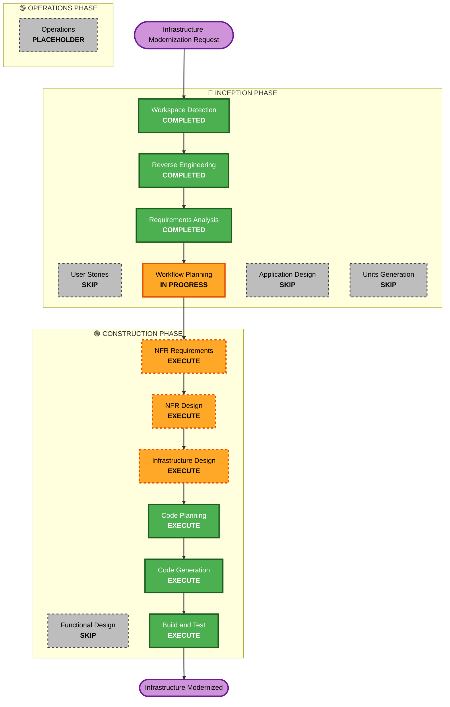

# Workflow Planning

## Detailed Analysis Summary

### Transformation Scope (Brownfield Project)
- **Transformation Type**: Infrastructure Transformation - Moving from external MongoDB to containerized setup with home server deployment
- **Primary Changes**: 
  - Containerize MongoDB database
  - Update Docker Compose configuration
  - Modify CI/CD pipelines for GitHub Container Registry
  - Configure CloudFlare tunnel for home server access
  - Set up Ubuntu Server VM on Proxmox
- **Related Components**: 
  - Docker configuration files (Dockerfile, docker-compose.yml)
  - Azure DevOps pipeline files (.azuredevops/build.yml)
  - Application configuration (appsettings.json)
  - Infrastructure setup (new Ubuntu VM, CloudFlare tunnel)

### Change Impact Assessment
- **User-facing changes**: No - Infrastructure changes are transparent to end users
- **Structural changes**: Yes - Moving from external MongoDB to containerized database, changing deployment target
- **Data model changes**: No - Application code and data models remain unchanged
- **API changes**: No - Application interfaces remain the same
- **NFR impact**: Yes - Improved security (CloudFlare tunnel), reliability (containerized setup), maintainability (unified Docker Compose)

### Component Relationships
**Primary Component**: Infrastructure and deployment configuration
- **Docker Configuration**: Dockerfile, docker-compose.yml (Major changes)
- **CI/CD Pipeline**: Azure DevOps build.yml (Major changes)
- **Application Configuration**: appsettings.json connection strings (Minor changes)
- **Infrastructure**: New Ubuntu VM, CloudFlare tunnel setup (New components)

**Change Dependencies**:
1. **Docker Compose** → **Application Configuration** (connection string updates)
2. **CI/CD Pipeline** → **GitHub Container Registry** (new registry configuration)
3. **Ubuntu VM Setup** → **Azure DevOps Agent** (deployment target)
4. **CloudFlare Tunnel** → **Domain Configuration** (external access)

### Risk Assessment
- **Risk Level**: Medium
- **Rollback Complexity**: Moderate - Can revert to external MongoDB and existing deployment
- **Testing Complexity**: Moderate - Need to test local development, CI/CD pipeline, and production deployment
- **Key Risks**: 
  - CloudFlare tunnel configuration conflicts with existing setup
  - Azure DevOps agent connectivity to home server
  - Docker Compose networking and secrets management
  - Data backup and recovery procedures

## Phase Determination Analysis

### User Stories - SKIP
**Rationale**: Infrastructure transformation project with clear technical requirements. No user experience impact or multiple personas involved. Requirements are well-defined and technical in nature.

### Application Design - SKIP  
**Rationale**: No new application components, services, or business logic needed. Existing application architecture remains unchanged. Changes are purely infrastructure and deployment related.

### Units Generation - SKIP
**Rationale**: Single infrastructure transformation unit. No need to break down into multiple development units as all changes are related and sequential.

### Functional Design - SKIP
**Rationale**: No new business logic, data models, or algorithms. Application functionality remains identical.

### NFR Requirements - EXECUTE
**Rationale**: Significant non-functional requirements around security (Docker secrets, CloudFlare tunnel), reliability (backups, rollback), and performance (containerized setup).

### NFR Design - EXECUTE  
**Rationale**: Need to design security patterns (Docker secrets), backup strategies, monitoring approach, and deployment architecture.

### Infrastructure Design - EXECUTE
**Rationale**: Major infrastructure changes including Docker Compose setup, Ubuntu VM configuration, CloudFlare tunnel design, and CI/CD pipeline architecture.

### Code Generation - EXECUTE (ALWAYS)
**Rationale**: Need to implement Docker Compose files, pipeline updates, configuration changes, and deployment scripts.

### Build and Test - EXECUTE (ALWAYS)
**Rationale**: Must validate local Docker setup, CI/CD pipeline functionality, and end-to-end deployment process.

## Workflow Visualization

## Phases to Execute

### 🔵 INCEPTION PHASE
- [x] Workspace Detection (COMPLETED)
- [x] Reverse Engineering (COMPLETED)
- [x] Requirements Analysis (COMPLETED)
- [x] User Stories (SKIPPED)
  - **Rationale**: Infrastructure project with no user experience impact
- [x] Workflow Planning (IN PROGRESS)
- [ ] Application Design - SKIP
  - **Rationale**: No new application components or business logic needed
- [ ] Units Generation - SKIP
  - **Rationale**: Single infrastructure transformation unit, no decomposition needed

### 🟢 CONSTRUCTION PHASE
- [ ] Functional Design - SKIP
  - **Rationale**: No new business logic, data models, or functional changes
- [ ] NFR Requirements Assessment - EXECUTE
  - **Rationale**: Significant security, reliability, and performance requirements for containerized setup
- [ ] NFR Design - EXECUTE
  - **Rationale**: Need to design Docker secrets, backup strategies, and deployment architecture
- [ ] Infrastructure Design - EXECUTE
  - **Rationale**: Major infrastructure changes including Docker Compose, VM setup, and CloudFlare tunnel
- [ ] Code Planning - EXECUTE (ALWAYS)
  - **Rationale**: Implementation approach needed for all infrastructure components
- [ ] Code Generation - EXECUTE (ALWAYS)
  - **Rationale**: Docker files, pipeline configs, and deployment scripts implementation
- [ ] Build and Test - EXECUTE (ALWAYS)
  - **Rationale**: Comprehensive testing of local setup, CI/CD, and deployment process

### 🟡 OPERATIONS PHASE
- [ ] Operations - PLACEHOLDER
  - **Rationale**: Future deployment and monitoring workflows

## Implementation Sequence

### Phase 1: Local Development Setup
1. **Docker Compose Configuration** - MongoDB container + application setup
2. **Local Testing** - Verify local development workflow

### Phase 2: CI/CD Pipeline Updates  
1. **GitHub Container Registry** - Configure image building and pushing
2. **Pipeline Modifications** - Update Azure DevOps build process
3. **Pipeline Testing** - Validate automated builds

### Phase 3: Home Server Infrastructure
1. **Ubuntu VM Setup** - Proxmox VM creation and configuration
2. **Azure DevOps Agent** - Install and configure on home server
3. **Deployment Testing** - Validate pipeline to home server

### Phase 4: CloudFlare Tunnel Configuration
1. **Tunnel Setup** - Configure new tunnel without interfering with existing
2. **Domain Configuration** - Set up fjapool.com and test.fjapool.com
3. **End-to-End Testing** - Validate external access

### Phase 5: Backup and Monitoring
1. **Backup Strategy** - Implement automated MongoDB backups
2. **Rollback Procedures** - Test deployment rollback capabilities
3. **Documentation** - Create operational procedures

## Estimated Timeline
- **Total Phases**: 5 construction phases
- **Estimated Duration**: 2-3 weeks (assuming part-time work)
- **Critical Path**: Ubuntu VM setup → Azure DevOps agent → CloudFlare tunnel

## Success Criteria
- **Primary Goal**: Containerized MongoDB with home server deployment via CloudFlare tunnel
- **Key Deliverables**: 
  - Working Docker Compose setup for local development
  - Updated CI/CD pipeline with GitHub Container Registry
  - Ubuntu VM with automated deployment capability
  - CloudFlare tunnel providing secure external access
  - Automated backup and rollback procedures
- **Quality Gates**: 
  - Local development workflow functional
  - Automated test deployment working
  - Production deployment with manual approval working
  - External access via CloudFlare tunnel operational
  - Backup and recovery procedures validated

## Risk Mitigation
- **CloudFlare Tunnel Conflicts**: Create separate tunnel configuration, test thoroughly before production
- **Azure DevOps Agent Issues**: Set up agent in isolated environment, validate connectivity
- **Docker Networking**: Use Docker Compose default networking, test container communication
- **Data Loss**: Implement backup before any production changes, test restore procedures