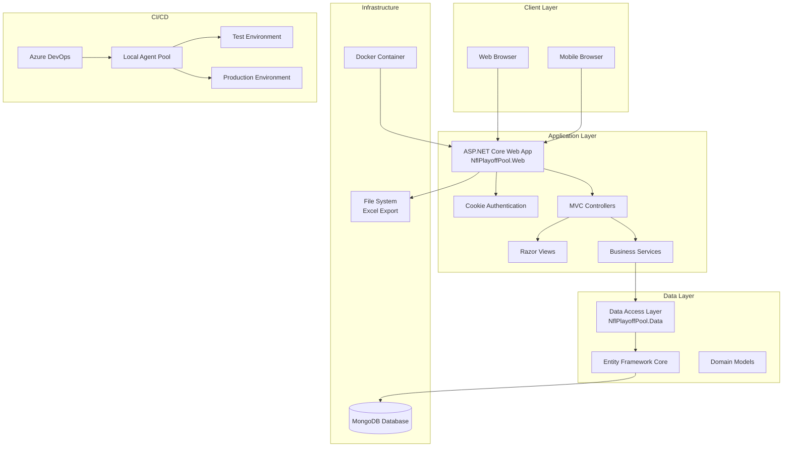
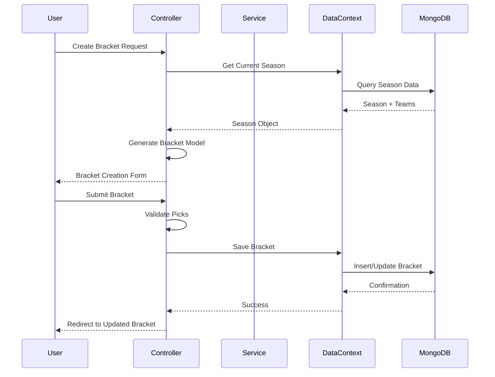

# System Architecture

## System Overview
NFL Playoff Pool is a containerized ASP.NET Core web application with MongoDB database backend. The system follows a layered architecture with web presentation, business logic, and data access layers. Currently configured for Azure DevOps CI/CD deployment to local agent pools.

## Architecture Diagram

## Component Descriptions

### NflPlayoffPool.Web (Main Web Application)
- **Purpose**: Primary web application providing user interface and business logic
- **Responsibilities**: 
  - HTTP request handling via MVC controllers
  - User authentication and authorization
  - Bracket management (create, update, submit)
  - Leaderboard calculation and display
  - Admin functionality for season management
- **Dependencies**: NflPlayoffPool.Data, ASP.NET Core, MongoDB.Driver, EPPlus
- **Type**: Application

### NflPlayoffPool.Data (Data Access Layer)
- **Purpose**: Data access and domain model management
- **Responsibilities**:
  - MongoDB Entity Framework Core integration
  - Domain entity definitions (User, Bracket, Season, etc.)
  - Database context management
  - Business logic extensions
- **Dependencies**: MongoDB.EntityFrameworkCore, Entity Framework Core
- **Type**: Library

### NflPlayoffPool.WebTests (Test Suite)
- **Purpose**: Automated testing for application components
- **Responsibilities**: Unit testing, integration testing, service validation
- **Dependencies**: NflPlayoffPool.Web, NflPlayoffPool.Data, testing frameworks
- **Type**: Test

## Data Flow

## Integration Points

### External APIs
- None currently identified

### Databases
- **MongoDB**: Primary database for all application data (users, brackets, seasons, teams)

### Third-party Services
- **EPPlus**: Excel file generation and processing
- **Azure DevOps**: CI/CD pipeline management

## Infrastructure Components

### Current Deployment Model
- **Containerization**: Docker-based deployment
- **CI/CD**: Azure DevOps with local agent pools
- **Environments**: Test and Production environments on local infrastructure
- **Database**: External MongoDB connection (not containerized)

### Networking
- **Ports**: 5000 (HTTP), 5001 (HTTPS - currently HTTP only)
- **Load Balancing**: Not configured
- **SSL/TLS**: Currently disabled in production
- **Reverse Proxy**: Not configured