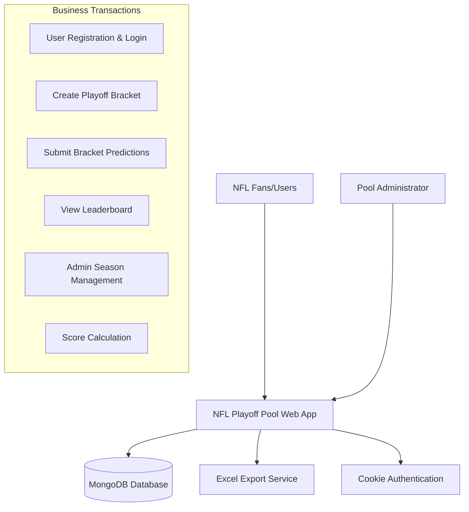

# Business Overview

## Business Context Diagram

## Business Description
- **Business Description**: NFL Playoff Pool is a web application that allows users to create and submit bracket predictions for NFL playoff games. Users compete against each other by predicting winners of playoff rounds (Wild Card, Divisional, Conference Championships, and Super Bowl). The system tracks scores and maintains a leaderboard throughout the playoff season.

- **Business Transactions**: 
  - **User Registration & Authentication**: Users can register and log in using cookie-based authentication
  - **Bracket Creation**: Users create named brackets with predictions for each playoff round
  - **Bracket Submission**: Users submit completed brackets before playoff games begin
  - **Score Tracking**: System calculates current scores and maximum possible scores for each bracket
  - **Leaderboard Management**: Real-time leaderboard showing rankings, ties, and eliminations
  - **Season Administration**: Admin functions to manage seasons, teams, and master brackets
  - **Data Import/Export**: Excel-based data import and export capabilities

- **Business Dictionary**: 
  - **Bracket**: A user's complete set of predictions for all playoff rounds
  - **Pick**: Individual game prediction within a bracket
  - **Season**: NFL playoff season with teams, games, and master results
  - **Master Bracket**: Official results used for scoring user brackets
  - **Playoff Rounds**: Wild Card (Round 1), Divisional (Round 2), Conference (Round 3), Super Bowl (Round 4)
  - **Conference**: AFC (American Football Conference) or NFC (National Football Conference)
  - **Leaderboard**: Ranked list of brackets by current score and maximum possible score

## Component Level Business Descriptions

### NflPlayoffPool.Web
- **Purpose**: Main web application providing user interface for bracket management and competition tracking
- **Responsibilities**: User authentication, bracket creation/editing, leaderboard display, admin functions

### NflPlayoffPool.Data
- **Purpose**: Data access layer managing MongoDB interactions and business entities
- **Responsibilities**: Database context, entity models, data persistence, business logic extensions

### NflPlayoffPool.WebTests
- **Purpose**: Test suite ensuring application reliability and correctness
- **Responsibilities**: Unit testing, integration testing, service validation