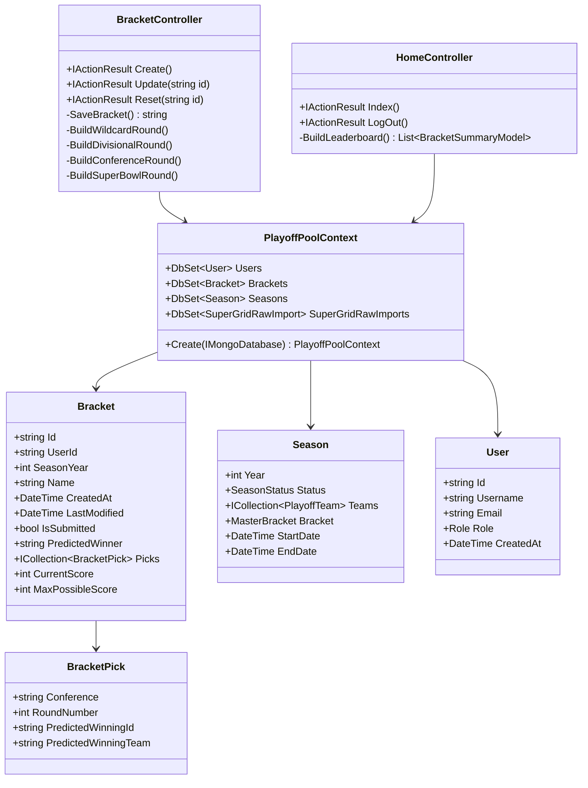

# Code Structure

## Build System
- **Type**: .NET SDK (Microsoft.NET.Sdk and Microsoft.NET.Sdk.Web)
- **Configuration**: 
  - Target Framework: .NET 8.0
  - Nullable reference types enabled
  - Implicit usings enabled
  - StyleCop analysis configured via stylecop.json
  - Docker support with Linux target OS

## Key Classes/Modules


## Design Patterns

### DbContext Pattern (Framework-First)
- **Location**: PlayoffPoolContext class
- **Purpose**: Direct data access leveraging EF Core's full capabilities
- **Implementation**: Entity Framework Core DbContext with DbSet properties, used directly in controllers
- **Rationale**: EF Core IS the abstraction - no additional repository layer needed

### MVC Pattern
- **Location**: Throughout web application
- **Purpose**: Separation of concerns between presentation, business logic, and data
- **Implementation**: ASP.NET Core MVC with Controllers, Views, and Models

### Dependency Injection
- **Location**: Program.cs and controller constructors
- **Purpose**: Loose coupling and testability
- **Implementation**: Built-in ASP.NET Core DI container

### Extension Methods Pattern
- **Location**: Various extension classes
- **Purpose**: Adding functionality to existing types without modification
- **Implementation**: Static extension methods for model conversions and business logic

## Critical Dependencies

### MongoDB.EntityFrameworkCore
- **Version**: 8.2.0
- **Usage**: Primary data access technology
- **Purpose**: Object-relational mapping for MongoDB

### MongoDB.Driver
- **Version**: 3.0.0
- **Usage**: Direct MongoDB operations
- **Purpose**: Low-level database connectivity and operations

### EPPlus
- **Version**: 7.6.1
- **Usage**: Excel file processing
- **Purpose**: Import/export functionality for bracket data

### ASP.NET Core Framework
- **Version**: .NET 8.0
- **Usage**: Web application framework
- **Purpose**: HTTP handling, MVC, authentication, dependency injection

## Project Structure
```
src/
├── NflPlayoffPool.Web/              # Main web application
│   ├── Controllers/                 # MVC Controllers
│   │   ├── AccountController.cs     # Authentication
│   │   ├── AdminController.cs       # Admin functions
│   │   ├── BracketController.cs     # Bracket management
│   │   └── HomeController.cs        # Dashboard/leaderboard
│   ├── Models/                      # View models and DTOs
│   ├── Views/                       # Razor view templates
│   ├── Services/                    # Business services
│   ├── Extensions/                  # Extension methods
│   ├── ViewModels/                  # View-specific models
│   ├── wwwroot/                     # Static web assets
│   └── Program.cs                   # Application entry point
├── NflPlayoffPool.Data/             # Data access layer
│   ├── Models/                      # Domain entities
│   │   ├── Bracket.cs              # User bracket entity
│   │   ├── Season.cs               # Season/tournament entity
│   │   ├── User.cs                 # User entity
│   │   └── [Other domain models]
│   ├── PlayoffPoolContext.cs       # EF Core DbContext
│   └── MFlixDbContext.cs           # Legacy context (unused?)
└── NflPlayoffPool.WebTests/         # Test project
    ├── Services/                    # Service tests
    └── TestFiles/                   # Test data files
```