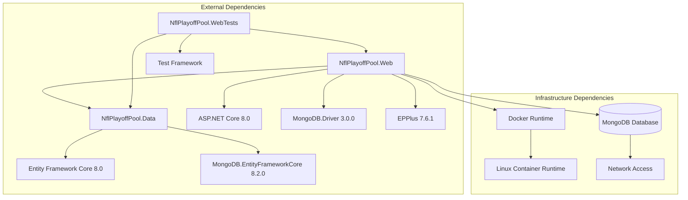

# Dependencies

## Internal Dependencies

## Project Dependencies

### NflPlayoffPool.Web depends on NflPlayoffPool.Data
- **Type**: Compile/Runtime
- **Reason**: Web application requires data access layer for database operations and domain models

### NflPlayoffPool.WebTests depends on NflPlayoffPool.Web
- **Type**: Test
- **Reason**: Test project needs access to web application components for testing

### NflPlayoffPool.WebTests depends on NflPlayoffPool.Data
- **Type**: Test
- **Reason**: Test project needs direct access to data layer for integration testing

## External Dependencies

### MongoDB.EntityFrameworkCore
- **Version**: 8.2.0
- **Purpose**: Provides Entity Framework Core integration with MongoDB database
- **License**: Apache License 2.0
- **Used By**: NflPlayoffPool.Data

### MongoDB.Driver
- **Version**: 3.0.0
- **Purpose**: Low-level MongoDB database connectivity and operations
- **License**: Apache License 2.0
- **Used By**: NflPlayoffPool.Web

### EPPlus
- **Version**: 7.6.1
- **Purpose**: Excel file generation and processing for data import/export
- **License**: Polyform Noncommercial License 1.0.0 (Commercial license required for commercial use)
- **Used By**: NflPlayoffPool.Web

### Microsoft.NET.Sdk.Web
- **Version**: 8.0 (implicit)
- **Purpose**: ASP.NET Core web application framework and runtime
- **License**: MIT License
- **Used By**: NflPlayoffPool.Web

### Microsoft.NET.Sdk
- **Version**: 8.0 (implicit)
- **Purpose**: .NET SDK for class library compilation and runtime
- **License**: MIT License
- **Used By**: NflPlayoffPool.Data, NflPlayoffPool.WebTests

## Infrastructure Dependencies

### Docker Runtime
- **Version**: Latest (not specified)
- **Purpose**: Container runtime for application deployment
- **Dependency Type**: Runtime Infrastructure

### MongoDB Database
- **Version**: Not specified (external service)
- **Purpose**: Primary data storage for application data
- **Dependency Type**: Runtime Infrastructure
- **Connection**: Via connection string (currently external, goal is to containerize)

### Linux Container Runtime
- **Version**: Latest compatible
- **Purpose**: Target deployment platform for Docker containers
- **Dependency Type**: Runtime Infrastructure

## Development Dependencies

### StyleCop.Analyzers
- **Version**: Latest (referenced via stylecop.json)
- **Purpose**: Code style analysis and enforcement
- **License**: Apache License 2.0
- **Used By**: All projects

## Deployment Dependencies

### Azure DevOps Agent
- **Version**: Latest
- **Purpose**: CI/CD pipeline execution
- **Dependency Type**: Build/Deploy Infrastructure

### Docker Compose
- **Version**: 3.3
- **Purpose**: Multi-container orchestration for deployment
- **Dependency Type**: Deploy Infrastructure

## Security Dependencies

### ASP.NET Core Authentication
- **Version**: 8.0 (part of framework)
- **Purpose**: Cookie-based user authentication
- **Dependency Type**: Runtime Security

### Anti-forgery Tokens
- **Version**: 8.0 (part of framework)
- **Purpose**: CSRF protection for form submissions
- **Dependency Type**: Runtime Security

## Potential Missing Dependencies (Based on Goals)

### CloudFlare Tunnel Client
- **Status**: Not yet implemented
- **Purpose**: Secure tunnel from home server to CloudFlare edge
- **Required For**: Home server deployment goal

### Home Server Infrastructure
- **Status**: Pipeline configured but may need updates
- **Purpose**: Target deployment environment
- **Required For**: Home server deployment goal

### Local MongoDB Container
- **Status**: Not yet configured
- **Purpose**: Containerized database for local development and deployment
- **Required For**: Local Docker setup goal